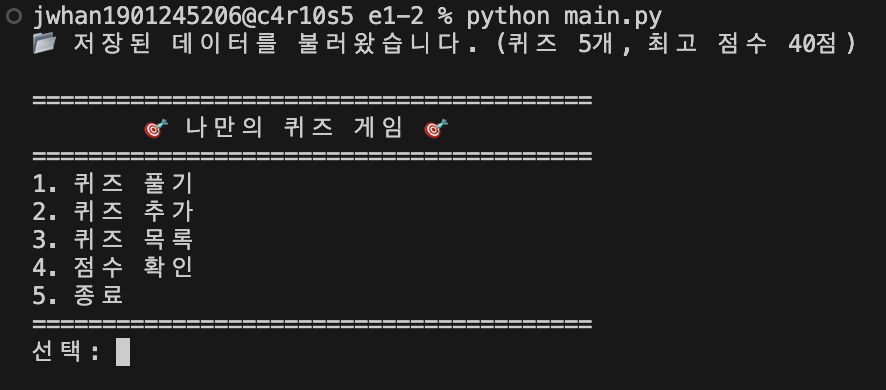
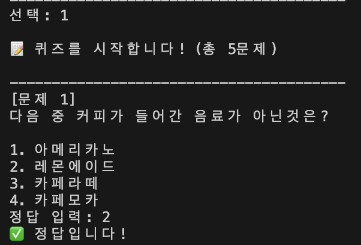
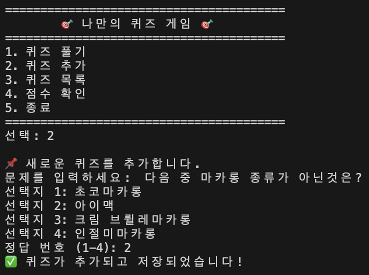
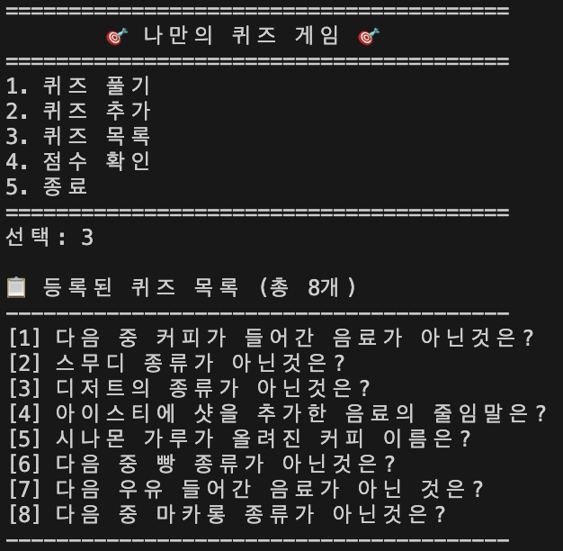
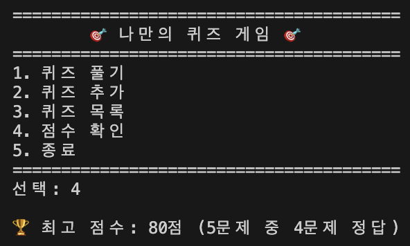

# 나만의 퀴즈 게임

## 1. 프로젝트 개요

Python으로 제작한 콘솔 기반 퀴즈 게임입니다.

사용자는 퀴즈를 풀거나 새로운 문제를 추가할 수 있으며, 등록된 퀴즈 목록과 최고 점수를 확인할 수 있습니다. 퀴즈 데이터와 최고 점수는 `state.json` 파일에 저장되어 프로그램을 종료한 후에도 유지됩니다.

<br>

## 2. 퀴즈 주제 선정 이유

이 프로젝트의 퀴즈 주제는 **카페 메뉴**입니다.  
평소 관심이 있던 분야이며, 다양한 난이도의 문제를 만들기 쉽다고 생각하여 해당 주제를 선택했습니다.

<br>

## 3. 실행 방법

### 실행 환경

- `Python 3.13.15`
- 외부 라이브러리 사용 없음

### 실행 환경 선정 이유

- 과제 조건 : Python 3.10 이상을 사용해야 한다.
- 안정적이고 충분히 검증된 3.13 vs 오류 메세지 등 다양한 기능의 3.14

```text
3 (Major) . 13 (Minor) . 15 (Patch)
```

### Minor

0. 안정성
1. 버전의 장단점
2. 기능적 차이

### Patch

Patch 버전은 같은 Major/Minor 버전에서 주로 버그 수정 및 보안 수정 등이 반영될 때 증가

### 실행 명령어

프로젝트 폴더에서 다음 명령어를 실행합니다.

```bash
python main.py
```

<br>

## 4. 기능 목록

- 메뉴 선택
- 퀴즈 풀기
- 정답 및 오답 확인
- 최종 점수 확인
- 새로운 퀴즈 추가
- 등록된 퀴즈 목록 확인
- 최고 점수 확인 및 갱신
- 퀴즈와 점수 데이터 저장
- 잘못된 입력 예외 처리
- 데이터 파일 오류 발생 시 기본 데이터 복구
- 안전한 프로그램 종료

<br>

## 5. 파일 구조

```text
e1-2/
├── screenshots/
│   ├── add_quiz/
│   │   └── 퀴즈추가,저장.png       # 퀴즈 추가 및 저장 화면
│   ├── check_quiz/
│   │   └── 최고점수.png            # 최고 점수 확인 화면
│   ├── quiz_list/
│   │   └── 퀴즈목록.png            # 등록된 퀴즈 목록 화면
│   ├── quiz_play/
│   │   └── screenshot_n1.png       # 퀴즈 풀이 화면
│   ├── exit_quiz.png               # 프로그램 종료 화면
│   ├── main_quiz.png               # 메인 메뉴 화면
│   └── screenshot_file.png         # 파일 저장 확인 화면
├── .gitignore                      # Git 추적 제외 파일 설정
├── main.py                         # Quiz, QuizGame 클래스 및 프로그램 실행
├── README.md                       # 프로젝트 설명 문서
└── state.json                      # 퀴즈 및 최고 점수 저장 파일
```

## 6. 데이터 파일 설명

### `state.json`

`state.json`은 프로젝트 루트에 위치하며 UTF-8 형식으로 저장됩니다. 데이터 구조는 다음과 같습니다.

- `quizzes`: 등록된 퀴즈 목록
- `question`: 문제 내용
- `choices`: 4개의 선택지
- `answer`: 정답 번호
- `best_score`: 0 ~ 100점까지의 최고 점수 또는 최고 정답 개수
- `best_correct`: 최고 기록에서 맞힌 문제 수
- `best_total`: 최고 기록 당시 전체 문제 수.

<br>

```json
{
  "quizzes": [
    {
      "question": "다음 중 커피가 들어간 음료가 아닌것은??",
      "choices": [
        "아메리카노",
        "레몬에이드",
        "카페라떼",
        "카페모카"
      ],
      "answer": 2
    }
  ],
  "best_score": 1
}
```
파일이 없는 경우 기본 퀴즈 데이터를 사용합니다. 파일이 손상되거나 읽기 오류가 발생한 경우 안내 메시지를 출력하고 기본 데이터로 복구합니다.

<br>

## 7. 실행 화면 스크린샷 구성

### 퀴즈 메인 메뉴



---

### 1. 퀴즈 풀기



---

### 2. 퀴즈 추가 / 저장



---

### 3. 퀴즈 목록



---

### 4. 점수 확인

