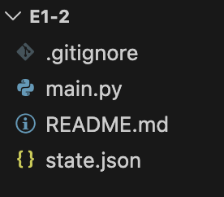

git 저장소 생성
```sh
git config --global user.name "Ji won-Han"

git config --global user.email "jwhan190124@gmail.com"

git clone https://github.com/jwhan12/e1-2.githttps://github.com/jwhan12/e1-2.git
```

.gitignore, README.md 파일 생성



